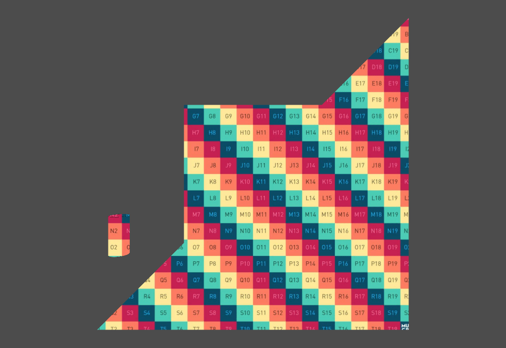

# unity-camera-projection

Unity base camera projective uv-mapping module. Not like verry common way of mapping an image in postprocessing, it bakes image to texture for each mesh. This corresponds to Autodesk Maya's camera projection system. https://docs.arnoldrenderer.com/display/A5AFMUG/Camera+Projection

## License
[MIT](LICENSE)
